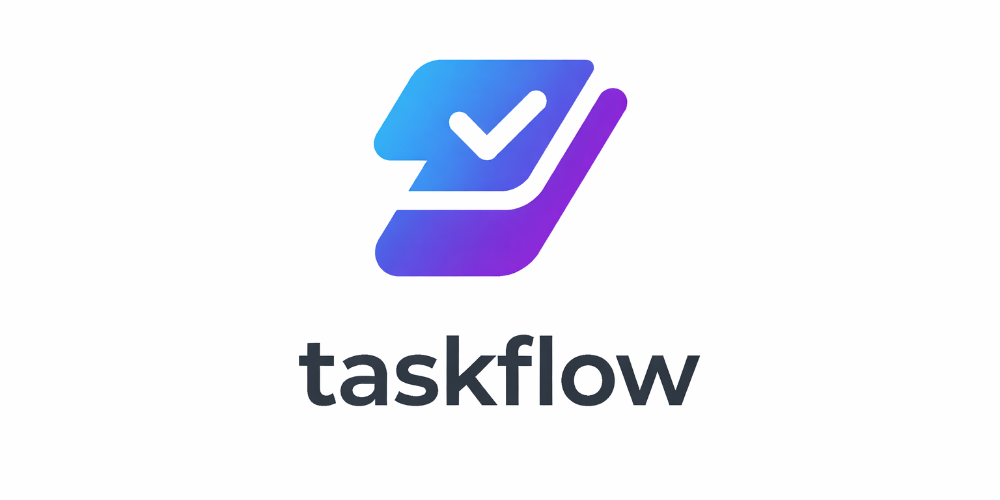

> [!Note]
> This project is work in progress and is not yet complete. The README will be updated as the project progresses.

# TaskFlow AI
TaskFlow AI is a project management tool (like Jira) that uses AI to manage tasks and projects for software development.
Its main goal is to keep task and project management clean and simple, with AI integration that
enables greater efficiency and structure. TaskFlow AI is built with **PHP Laravel** with **React (Typescript)** in a single
stack. Communication between the backend and frontend is handled by **inertia**.

## Table of contents
- [Features](#features)
- [Technologies](#technologies)
- [Installation](#installation)

## Features
- User authentication: Register, login, and manage user accounts
- Project management: Create and manage projects

## Technologies
Following technologies are used in this project:
- PHP 8.5
- Laravel 13
- React 19.2
- Inertia 3
- SQLite

## Installation
To install TaskFlow AI, make sure development environment tool **Herd** is installed on your machine.
Then, follow these steps:

1. Clone repository to `C:\Users\Admin\Herd`
2. Duplicate `.env.example` and rename it to `.env`. Make sure a valid APP_URL is given like in the real `.env` file `APP_URL=http://taskflow-ai.test`.
3. Generate APP_KEY by running `php artisan key:generate` in the terminal.
4. Migrate the database by running `php artisan migrate --seed` in the terminal.
5. Since you are working with Herd you can simply run the vite development server by running `npm run dev` in the terminal.
6. Open your browser and navigate to `http://taskflow-ai.test` to access the application.
7. You can register a new account or use the seeded account with email